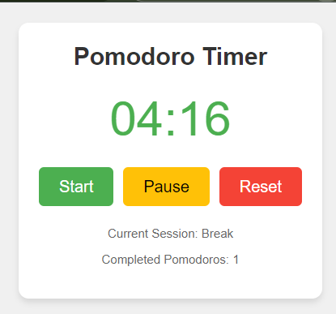

# Pomodoro Timer Chrome Extension

A simple and effective Pomodoro Timer extension for Chrome to boost your productivity and manage your work/break cycles.

## Features

- 25-minute work sessions followed by 5-minute breaks
- Visual timer display
- Start, pause, and reset functionality
- Track completed Pomodoros
- Chrome notifications for session changes
- Persistent timer state across browser restarts

## Installation

1. Clone this repository or download the ZIP file.
2. Open Chrome and navigate to `chrome://extensions`.
3. Enable "Developer mode" in the top right corner.
4. Click "Load unpacked" and select the directory containing the extension files.

## Usage

1. Click the Pomodoro Timer icon in your Chrome toolbar to open the popup.
2. Press "Start" to begin a 25-minute work session.
3. When the timer reaches zero, you'll receive a notification to take a break.
4. After the 5-minute break, you'll be notified to start another work session.
5. Use the "Pause" button to pause the timer at any time.
6. Click "Reset" to start over from the beginning of a work session.

## Development

This extension is built using HTML, CSS, and JavaScript. It utilizes Chrome's extension APIs for background processes, alarms, and notifications.

### Project Structure

- `manifest.json`: Extension configuration
- `popup.html`: Main interface
- `script.js`: Popup logic
- `background.js`: Background service worker
- `pomodoro-styles.css`: Styles for the popup

## License

This project is licensed under the MIT License - see the [LICENSE](LICENSE) file for details.

